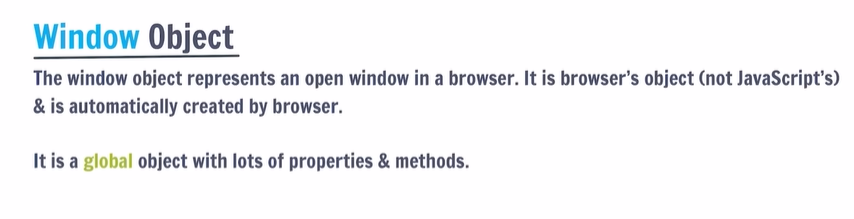
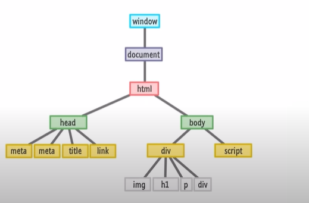
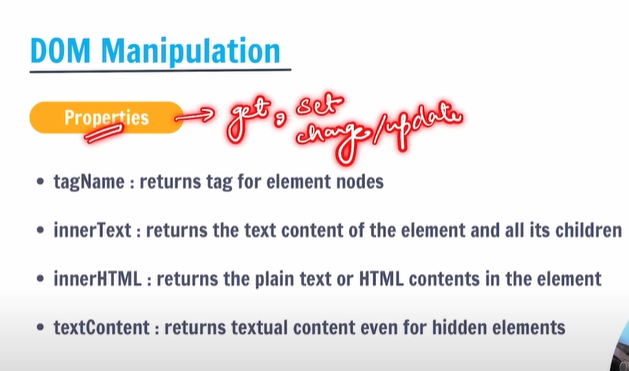
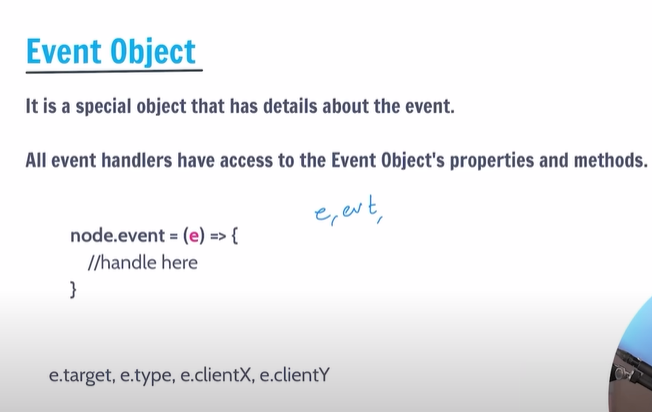
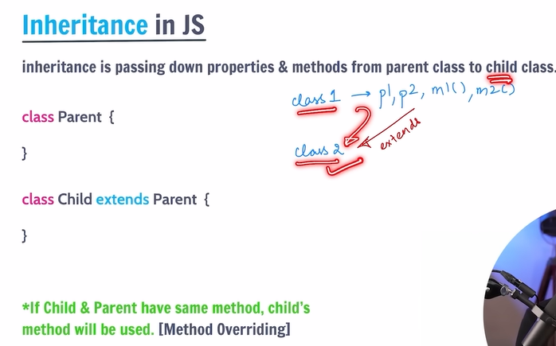
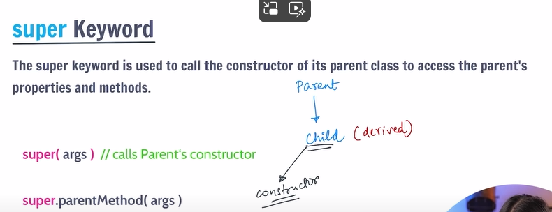
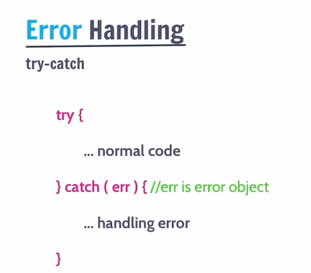
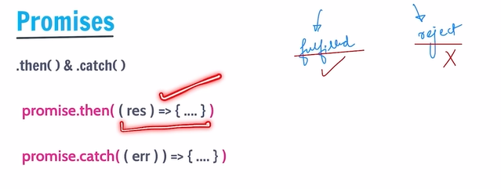
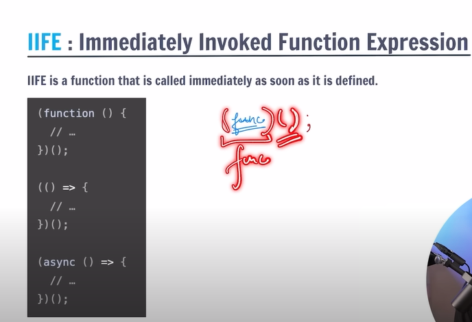

# JS
-> it is a dynamically typed language means hume phle se hi apne variable ka type nhi btana pdta vo runtime pe jake calculate krlte hai <br>
1. alert ("") -> for generating alerts/message on browser as a one time pop-up
2. console.log("") -> for generating output on console in browser
3. prompt ("") -> its a temporary way of taking input from user. <br>
like alert is used to display message as pop up and propmt also do so but additionally we can also get user input from prompt. <br>
it takes number in form of string always so if u want to compare any number with prompt entered number dont use === of !== just use == or != 

## variables in js :
- variables are containers for data
- if variable name contains two words then we take first word's first letter as lower case and second words first letter as upper case <br>
for eg : fullName , this is called camel case and this is done generally to define varibale's name
 
**let, const var:**
- to define variables we can use 3 keywords in js: let,const & var (let & const used mostly)
- var - can be re-declared and updated. its a global scope variable.
- let - cannot be re-declared but can be updated. its a block scope variable. <br>
if a variable is declared like let a; but value is not assigned to variable and we try to print it then output is undefined.
- const - cannot be re-declared or updated. its also a block scope variable. <br>
if a variable is declared like const a; but value is not assigned to variable and we try to print it then error generates as the const declarations must be initialized.

## Data Types in js :
There are 2 data types in js:
- Primitive Data types: 7 types
- Non-primitive data types: object : objects ki hi andr ki category is array, functions. <br>
u can say object is a collection of values and contains info is form of `key:value` pairs in a block. <br>
generally we declare objects with const, but we can also use let. for eg: here student is the object.  
```
const student = {
    name: "Deepak",
    age: 20,
    cgpa: 9.5,
    isPass: true,
    scores: {
        maths: 95,
        english: 98
    }
};
```
and we can also change or update the value of a variable in object like: `student["age"] = student["age"]+1` or `student["name"]="Shivi"`

object is of const type but u can change its key's values bcoz only by changing value of 1 or 2 keys dosent change the object, <br>
error will be generated when u try to change all values of keys in object. 

if u want to access key in object u can do so by 2 methods:
1. object.keyname
2. object["keyname"]

*Note:* if u want to see the datatype of your variable u can do so by `typeof` method [ syntax: `typeof variable name`]

**Primitive Data Types:**
1. Number
2. String
3. Boolean
4. Undefined : by default, all variables are unefined till they are not assigned any value
5. Null : it is the absence of an object 
6. BigInt : big integers and jiska datatype bigint hota h then uske output k last mein aapko 'n' dikhayi dega eg: 123n
7. Symbol : let y= symbol("hello") output is: Symbol(Hello)

## Comments:
1. single line: //
2. multi line: /* */

## Operators:
used to perform some operation on data.


-> if we compare 5 == "5" then it returns true in js even though 5 is number and "5" is string <br>
-> this is bcoz in js if there is a single number in " " then js converts string in number and then compares it will other number <br>
-> so if we dont want this to happen so we use stricter method ie === in which not only the values but also the datatype gets compared <br>
-> so now if we do 5==="5" it will return false <br>
-> and same is with not equal to , !== <br>

## Loops:
to execute a piece of code again and again. <br>
1. for 
2. do while 
3. while 
4. for-of -> string and arrays pe loop lgane mein help karta hai but not for objections <br>
initialization, stopping, updation apne aap hoga we dont need to do anything in this <br>
syntax: 
```
for(let val of string){
    do some work
}
```
eg:
```
let str="JavaScript";
let size=0;
for(let i of str){
    console.log(i);
    size++;
}
console.log("string size is: ",size);
```
5. for-in -> this loop is used for objects <br>
syntax:
```
for(let key in object){
    do some work
}
```
eg:
```
let student = {
    name : "Krishna",
    age : 20,
    cgpa : 8.0,
    isPass : true,
};
for (let i in student){
    console.log("key: " , i, "values: " , student[i]);
}
```

## Strings:
its a sequence of characters used to represent text. <br>
they are immutable in JS. <br>
to get length of string, use `stringname.length` <br>

*Template Literals:* its a special type of string enclosed in `` and it can store string as well as number in it. <br>
its a way to have embedded expressions in strings. <br>

like if u create an object :
```
let obj = {
    item : "pen",
    price : 10
};
```
so output can be printed as `console.log("the cost of",obj.item,"is",obj.price,"rupees");` <br>
but with template literal u can simply have same output as:
```
let output = `the cost of ${obj.item} is ${obj.price} rupees`;
console.log(output);
```
and if used in strings like if we do this:
```
let str = `This is a string ${1+2+2}1;
console.log(str);
```
so, in this it wont print like "this is a string123" like it typically does in strings instead it will print "This is a string 6" <br>

*Escape charcaters:* /n -> next line, /t -> tab space , etc. <br>
they occupy 1 space in memory. <br>

**String Methods in JS:** <br>
these methods do not change or modify our original string, it creates a new string with new value and returns it. <br>
so even after applying these methods if u try to output the original string, it will be the same as they were before applying these methods. 
1. for upper case -> str.toUpperCase()
2. for lower case -> str.toLowerCase()
3. to remove whitespaces from start and end of string  -> str.trim()
4. to return some part of string -> str.slice(start,end)
5. to join two string (str2 with str1) -> str1.concat(str2)
6. to replace a character in string -> str.replace(searchVal,newVal) <br>
but this replaces only once for first occurence in string only<br>
if u want to replace each occurence in string then u should use `replaceAll` instead of replace, `syntax: str.replaceAll(searchVal,newVal)` <br>
7. to search a character at an index in string -> str.charAt(idx)

## Arrays:
it is a collection of items and it is an object in js. <br>
its an `index:value` pair. <br>
Arrays are mutable in JS. <br>

**Array Methods in JS:** <br>
1. push() -> add to end
2. pop() -> delete from end and return
3. toString() -> converts array to string <br>
does not affect original array, creates a new string with string values 
4. concat() -> joins multiple arrays and returns result <br>
it also does not affect original array, creates new array with new values
5. unshift() -> add to start
6. shift() -> delete from start and return
7. slice() -> returns a piece of array. `syntax: slice(start,end)` <br>
does not change in original array. 
8. splice() -> change original array (add,remove,replace) `syntax: splice(start,delcount,newele...)`


## Functions :
block of code that performs a specific task, can be invoked whenever needed <br>
syntax:
```
function funcname() {
    do some work
}
```

**Arrow Functions:**  <br>
compact way of writing functions <br>
`sign : =>` <br>
generally used for small work. <br>
syntax:
```
const funcname = (param1, param2...) => {
    do some work
}
```
eg :
```
this if func declaration in a variable called sum. 
const sum = (a,b) => {
    return a + b;
}
sum(3,4); // function calling
```

**forEach loop in Arrays:** <br>
`syntax: arr.forEach(callBackFunction)` <br>
CallbackFunction : here, it is a function to execute for each element in array <br>
*A callback is a function passed an an argunment to another function. <br>
forEach works like an arrow function and it can take 3 paramters in it (values, index, array itself) <br>
-> and they are higher order functions / methods <br>
eg:
```
arr.forEach((val) => {
    console.log(val);
})
```

*NOTE:* Higher order functions/methods are those functions that takes another function as an argument/paramter or returns another function. <br>
callback functions are always higher order functions <br>

**Some More Array Methods:** <br>
1. Map : creates a new array with the results of some operation. <br>
the values its callback returns are used to form new array. <br>
`syntax: arr.map(callbackfunc(value,index,array))` <br>
for eg: 
```
let newarr = arr.map((val) => {
    return val * 2;
})
```

2. Filter : creates a new array of elemenets that gives true for a condition/filter. <br>
eg : all even elements. 
```
let newarr = arr.filter((val) => {
    return val % 2 === 0;
})
console.log(newarr);
```

3. Reduce: performs some operations & reduces the array to a single value. it returns that single value. <br>
eg : avg , sum of array elements.
```
let arr = [1,2,3,4,5];
const output = arr.reduce((res,curr) => {
    return res+curr;
});
console.log(output);
```
result stores result of every operation of addition in this code and curr is incremented to next element after every operation and there values are added and returned to give a single output value. <br>
initially, results = arr[0] and val = arr[1] <br>

## Window Object :


## DOM :
When a web page is loaded, the browser creates a Document Object Model (DOM) of the page.



-> our whole html code that is connected with js file can be accessed within js as our every html element gets converted into a special object object in js file automatically and that object is called document which is within the window object and this is what we call as DOM. <br>
-> so if in console we write `window.document` it will give info about every element included in the html file that is linked with the js file <br>

*console.log vs console.dir:* <br>
-> console.log is used to print something. <br>
-> whereas console.dir is used for special objects like document object and it tell us all the properties and methods included within that object and its also a part of our window object. <br>
-> so if we want our objects to get printed we use console.dir except of console.log <br>

*DOM Summary* -> html ko js mein access krne ka tarika hai DOM. <br>
and its used for any dynamic changes or mainpulation in our webpage. <br>

*NOTE:* if we write script tag in our head and then try to access html body using DOM so that wont be possible because body is not loaded at that time bcoz head comes before body hence first script tag will execute and then body, thats why we write our script tag after body. <br>

## DOM Manipulation:
1. Selecting with id: document.getElementById("myId") <br>
if we try to access an element with an id name thats not present in html code then it return null in console.
2. Selecting with class: document.getElementsByClassName("myClass") <br>
it returns a html collection <br>
if we try to access elements with a class name thats not present in html code then it return empty html collection in console.
3. Selecting with tag: document.getElemetsByTagName("p") <br>
it also returns a html collection with same tag <br>
4. Query Selector : document.querySelector("myId/myClass/tag") <br>
this returns the first element. <br>
document.querySelectorAll("myId/myClass/tag") <br>
this returns a NodeList. <br>
access tag by tagname in double quotes, access class by '.' followed my class name in double quotes like ".myClass" and access id by '#' followed by id name in double quotes like "#myId" 



*NOTE:* when there is a dom tree so it has 3 type of nodes : text node, comment node and element node. <br>
element node contains the elements of html file and this is the node that we typically use. <br>

**Attributes:** <br>
1. getAttribute(attr) -> to get attribute value of an node or html element
2. setAttribute(attr,value) -> to set the attribute value

**Style:** <br>
- node.style -> isse kisi bhi node ka style aajata hai and usse chnage bhi kia ja skta hai <br>

**Insert Elements:**
let el = document.createElement("div")
- node.append(el) -> adds at the end of node (inside)
- node.prepend(el) -> adds at the start of node (inside)
- node.before(el) -> adds before the node (outside)
- node.after(el) -> adds after the node (outside)

**Delete Element:**
- node.remove() -> removes the node

**ClassList:** <br>
-> classList is used to add or remove class from an element or to add multiple classes to single element. <br>
-> classList is different from setAttribute as it does not remove the previous class instead adds new class while setAttribute replaces previous class with new class. <br>
`tagname.classList.add("newClass")` or `tagname.classList.remove("newClass")`

## Events:
-> the change in state of an object is known as an event <br>
-> events are fired to notify code of "interesting changes" that may affect code execution <br>
-> they can arise from user interactions or by environment. 

*Type of Events:* <br>
- mouse events (click, double click etc.)
- keyboard events (keypress, keyup, keydown etc.)
- form events (submit, register etc.)
- print event and many more

syntax: 
```
node.event = () => {
    handle event here
}
```

*Drawbacks:* <br>
- if we write event handling in inline way in html code and in js file so priority will be given to the js file code
- and if we write multiple event hndling for same event on same element then first event handler gets overwite by the second

**Event Object:** <br>



**Event Listeners:** <br>
-> handles events and for one event we can create multiple event listeners <br>
-> callback function is the event handler <br>
-> we can also access event object in this. <br>
- node.addEventListener(event,callback)
- node.removeEventListener(event,callback) 

*Note:* callback reference should be same to remove <br>

## Classes and Objects:

**Prototypes in JS:** <br>
- A JS object is an enity having state and behaviour (properties and method)
- JS Objects have a special property called prototype which in itself is an object and its type if that it is basically a reference to an object or it can be null also. 
- we can set prototype using `__proto__` <br>
eg: `obj2.__proto__= obj1` where obj2 is where we are inherting the prototype of obj1 that we defined on our own 

*NOTE:* If object and prototype have same method, object's method will be used. <br>

so, basically when an object is created there's a number of inbuilt functions and methods that we dont need to define and they have their own behaviour which comes from/under the prototype property of object and we can even define our own prototypes for an object. <br>

**Class:** <br>
- its a program-code template/blueprint for creating objects.
- those objects will have some state (variables) & some behaviour (functions) inside it. <br>
syntax: 
```
class MyClass{
    constructor() {...}
    myMethod() {...}
}
let myObj=new MyClass();
```

**Inhertiance:** <br>
-> done by special keyword "extends"



*Super Keyword:*



**Error Handling:** <br>
-> if like u wrote 10 lines of code and an errr occurs at 3rd line so first 2 lines will execute but then at 3rd line error will be shown and next lines wont get executed even though they didnt contain any error so for that to not happen and except for error line others to work properly we use this error handling `try-catch` method. 



## Callbacks, Promises & Async-await:
-> async await >> promise chains >> callback hell <br>

**Difference synchronous and Asynchornous Progamming:** <br>
*Synchronous:* this means the code runs in particular sequence of instructions given in program. each instruction waits for previous instruction to complete its execution <br>
*Asynchronous:* due to synchronous programming, sometimes imp instructions get blocked due to some previous instructions, which causes delay in UI. Asynchronous code execution allows to execute next instructions immediately and dosent block the flow. <br>

**Callback:** <br>
-> it is a function passed as an argument to another function. <br>
-> when we use this then in real time programming, there arises an issue called *callback hell*. <br>

**Callback Hell:** <br>
-> they are nested callbacks stacked below one another forming a pyramid structure (*pyramid of doom*) <br>
-> this style of programming becomes difficult to understand and manage. <br>
-> to tacklethis issue we use *promises* <br>

**Promises:** <br>
-> promise is for "eventual" completion of task. <br>
-> it is an object in JS. <br>
-> it is a solution to callback hell. <br>

`let promise = new Promise((resolve, reject) => {...})` <br>
this is a function with 2 handlers. <br>
*resolve & reject are callbacks provided by JS. <br>

*States in Promise:* <br>
1. pending -> the result is undefined 
2. fulfilled -> the result is a value(fulfilled)  `resolve(result)` 
3. rejected -> the result is an error object `reject(error)` <br>
*Promise has state (pending, fulfilled) and some result (result for resolve and error for reject) 

generally, promise is completed after its resolved or rejected <br>



**Async-Await:** <br>
async function always returns a promise. <br>
`syntax: async function myFunc() {...}` <br>
await pauses the execution of its surrounding async function until the promise is settled. <br>
and await keyword can only be used in an async function nowhere else <br>

**IIFE: Immediately invoked function expression** <br>
-> with this u dont even need to call func as they are nameless func and get called and executed automatically. <br>
-> however, they are executed only once and if want to execute the same code again u will need to write the whole code again <br>

