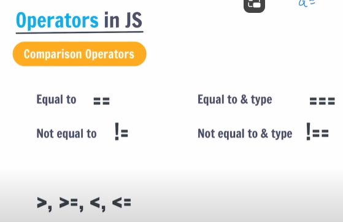

# JS
-> it is a dynamically typed language means hume phle se hi apne variable ka type nhi btana pdta vo runtime pe jake calculate krlte hai <br>
1. alert ("") -> for generating alerts on browser
2. console.log("") -> for generating output on console in browser

## variables in js :
- variables are containers for data
- if variable name contains two words then we take first word's first letter as lower case and second words first letter as upper case <br>
for eg : fullName , this is called camel case and this is done generally to define varibale's name
 
**let, const var:**
- to define variables we can use 3 keywords in js: let,const & var (let & const used mostly)
- var - can be re-declared and updated. its a global scope variable.
- let - cannot be re-declared but can be updated. its a block scope variable. <br>
if a variable is declared like let a; but value is not assigned to variable and we try to print it then output is undefined.
- const - cannot be re-declared or updated. its also a block scope variable. <br>
if a variable is declared like const a; but value is not assigned to variable and we try to print it then error generates as the const declarations must be initialized.

## Data Types in js :
There are 2 data types in js:
- Primitive Data types: 7 types
- Non-primitive data types: object : objects ki hi andr ki category is array, functions. <br>
u can say object is a collection of values and contains info is form of `key:value` pairs in a block. <br>
generally we declare objects with const, but we can also use let. for eg: here student is the object.  
```
const student = {
    name: "Deepak",
    age: 20,
    cgpa: 9.5,
    isPass: true,
    scores: {
        maths: 95,
        english: 98
    }
};
```
and we can also change or update the value of a variable in object like: `student["age"] = student["age"]+1` or `student["name"]="Shivi"`

object is of const type but u can change its key's values bcoz only by changing value of 1 or 2 keys dosent change the object, <br>
error will be generated when u try to change all values of keys in object. 

if u want to access key in object u can do so by 2 methods:
1. object.keyname
2. object["keyname"]

*Note:* if u want to see the datatype of your variable u can do so by `typeof` method [ syntax: `typeof variable name`]

**Primitive Data Types:**
1. Number
2. String
3. Boolean
4. Undefined : by default, all variables are unefined till they are not assigned any value
5. Null : it is the absence of an object 
6. BigInt : big integers and jiska datatype bigint hota h then uske output k last mein aapko 'n' dikhayi dega eg: 123n
7. Symbol : let y= symbol("hello") output is: Symbol(Hello)

## Comments:
1. single line: //
2. multi line: /* */

## Operators:
used to perform some operation on data.



-> if we compare 5 == "5" then it returns true in js even though 5 is number and "5" is string <br>
-> this is bcoz in js if there is a single number in " " then js converts string in number and then compares it will other number <br>
-> so if we dont want this to happen so we use stricter method ie === in which not only the values but also the datatype gets compared <br>
-> so now if we do 5==="5" it will return false <br>
-> and same is with not equal to , !== <br>

