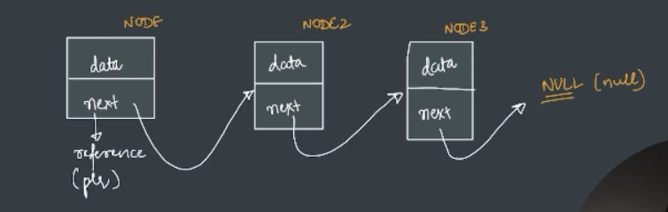
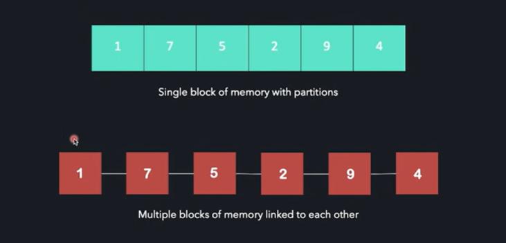

# Linked List
its a linear type of data structure  
its elements are connected by a chain/link to the next element  
single element in a list is called a node  
when we connect nodes by a link, then that is every node in a linked list has two parts-   
first part is the data it stores which can be any data like int,string,bool,float etc.  
second part is a next (pointer) to the next node in the list. (address of next node)  
head pointer stores the address of first node in the list so by this we can figure out from where our list gets started.  
the link is stopped by a NULL pointer (or a null value)  
the last node's next field will store null indicating the end of linked list.  
tail node is last valid node which contains some before. its usually before null node.  

array is single block of memory with partitions whereas linked list is multiple block of memory linked to each other.    

limitations of array:  
-> fixed size  
-> contiguous block of memory  
-> inserting/deleting is costly  

properties of linked list:  
-> size can be modified  
-> non-contiguous memory  
-> insertions/deletions at any point is easier  
