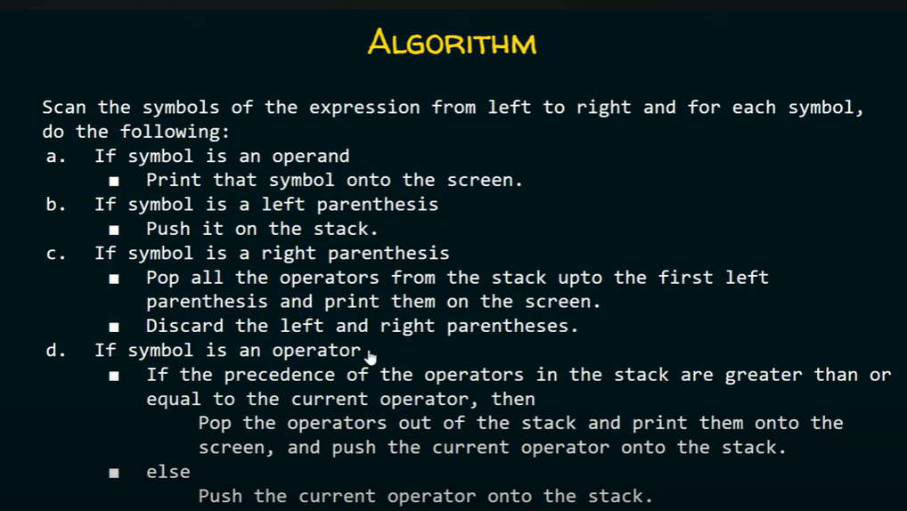

# stack
- lifo principle
- sirf top pe hi operations hote hai sare like insertion, deletion, etc. 
- we do it with usage of top pointer 
- 4 operations : push,pop,top,empty
- all are performed in constant time, ie time complexity is O(1)
- initially top=-1 and this means stack is empty

## Application of stack
1. infix - its simple expression like 2+3, a*c+d, (8/2)-5 etc  
2. prefix - polish notation and in this operator comes first and then comes the operand to which the operator must be applied on. eg: +*423 so this will evaluate to `4*2` and then `result+3`  
syntax: `<operator><operand><operand>` 
syntax: `<operand><operator><operand>`
3. postfix - reverse polish notation and its expression when operator comes after operand eg: 42*3+ will be evaluated like `4*2` then `result+3`  
syntax: `<operand><operand><operator>`

time complexity is O(n) where n is length of string

### infix to postfix 

### infix to prefix

